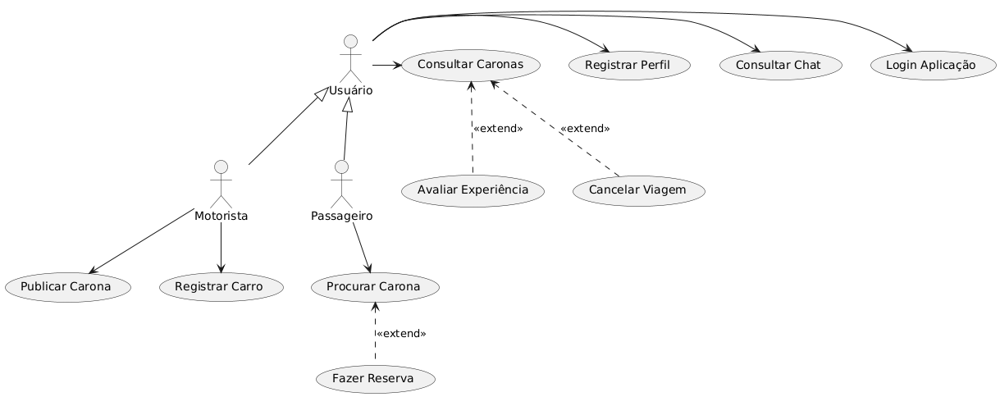

# Zipps

O Zipps é um aplicativo de carona sem fins lucrativos que busca conectar passageiros e motoristas de maneira eficiente e segura. O objetivo é oferecer um meio para o compartilhamento de viagens, facilitar a procura por pessoas com trajetos coincidentes e pontos de partida próximos da sua localização atual, permitindo a divisão de custos no transporte.

Dentre as suas principais funcionalidades, os usuários podem consultar o histórico de caronas e avaliações entre os envolvidos. Ao manifestar interesse em uma publicação, o passageiro ganha acesso ao chat integrado para o esclarecimento de dúvidas e informações adicionais para com o motorista; após a finalização da carona, o sistema de avaliação permite que motoristas e passageiros se avaliem mutuamente. Além disso, o Zipps oferece filtros que possibilitam escolher caronas específicas, como viagens excluvisamente para mulheres ou outras preferências pessoais.

O cliente é cobrado uma taxa para a manutenção de custos operacionais no momento da reserva.

## Requisitos da primeira versão (MVP)

- Usuários podem se cadastrar na plataforma com informações básicas, como nome, e-mail e senha.
- Usuários cadastrados no sistema passarão por um processo de verificação via e-mail.
- Passageiros podem pesquisar caronas com base em critérios como avaliações, preço, data etc.
- O motorista publica a carona, descrevendo o trajeto percorrido até o destino no mapa, o número de vagas e o custo por passageiro.
- Após o processo de geolocalização, o passageiro pode manifestar o seu interesse na carona por meio do ato de reserva, pagando uma taxa pré-definida para o aplicativo.
- Após a reserva, os envolvidos podem se comunicar via chat para discutir outras informações.
- Tanto o motorista quanto o passageiro possuem o direito de cancelar sua reserva; no segundo o caso, o custo de reserva é reembolsado pelo aplicativo.
- Após a conclusão da carona, tanto o passageiro e o motorista podem avaliar a experiência de forma generalizada (1 a 5 estrelas), além de terem a opção de oferecer comentários quanto a cordialidade ou outros atributos.
- Caronas finalizadas e avaliações serão refletidas no perfil do usuário para referência futura.

## Observações

- Manutenção das caronas e filtros associados.
- Manutenção de usuários: nome, CPF, telefone, e-mail, sexo e data de nascimento.
- Compatibilidade com dispositivos móveis Android, responsivo para larguras de tela com 350px ou superior.
- Filtro:
- Pagamento:

## Casos de Uso

### Diagrama

### Descrição dos Casos de Uso

**Registrar Perfil (UC01)**:
- Ator: Usuário
- Pré-condição: O usuário acessa o aplicativo pela primeira vez.
- Pós-condição: O usuário tem um perfil ativo no sistema.
- Fluxo principal:
     1. O usuário preenche o e-mail para a verificação (A1).
     2. Após a verificação, o usuário fornece informações relevantes para o seu cadastro, incluindo nome, senha, e modelo de carro (opcional).
     3. O sistema valida as informações e cria um perfil para o usuário.
- Pós-condição: O usuário tem um perfil ativo no sistema.
- Fluxo alternativo:
-   A1. O usuário fornece as informações relevantes ao aplicativo por meio da API do Facebook.

**Login Aplicação (UC02)**
- Ator: Usuário
- Pré-condição: O usuário já possui um perfil registrado.
- Pós-condição: O usuário está logado no sistema e pode acessar suas funcionalidades.
- Fluxo principal:
     1. O motorista insere suas credenciais (e-mail e senha).
     2. O sistema autentica o usuário e dá acesso ao aplicativo.
        
**Publicar Carona (UC03)**:
- Ator: Motorista
- Pré-condição: O usuário deve estar logado no aplicativo.
- Pós-condição: A carona está disponível para ser reservada por passageiros; o carro deve estar registrado no sistema.
- Fluxo principal:
     1. O motorista insere as informações sobre a carona, incluindo data, horário, local de partida, destino, e trajeto.
     2. O motorista define o número de vagas disponíveis e o valor estimado por pessoa.
     3. O sistema valida os dados inseridos e publica a carona no sistema.
  
**Procurar Carona (UC04)**:
- Ator: Passageiro
- Pré-condição: O passageiro está logado no aplicativo.
- Pós-condição: A carona é exibida com os detalhes necessários para o passageiro fazer uma reserva, juntamente com a foto do motorista e sua avaliação.
- Fluxo principal:
     1. O passageiro insere os critérios de busca, como origem, destino, data e filtros de preferência (editar).
     2. O sistema exibe uma lista de caronas que correspondem aos critérios inseridos.
     3. O passageiro seleciona uma carona de interesse.

**Fazer Reserva (UC05)**:
- Pré-condição: O passageiro encontrou uma carona disponível que atende as suas preferências.
- Pós-condição: O passageiro possui uma reserva confirmada na carona selecionada, atualizando o número de passageiros.
- **Fluxo principal**:
     1. O passageiro seleciona a carona e confirma a reserva.
     2. O sistema atualiza a carona com a reserva do passageiro.
  
**Consultar Chat (UC06)**:
- Pré-condição: O usuário está logado e possui caronas em andamento ou reservas confirmadas.
- Pós-condição: O usuário pode se comunicar com os passageiros.
- Fluxo principal:
     1. O usuário acessa a área de chat e visualiza a lista de passageiros associados às suas caronas. (editar)
     2. O usuário pode enviar e receber mensagens relacionadas a viagem.
 
**Consultar Reservas (U07)**:
- Pré-condição: O motorista está logado e possui caronas publicadas.
- Pós-condição: O motorista pode visualizar e gerenciar as reservas das suas caronas.
- Fluxo principal:
     1. O motorista acessa as reservas associadas às suas caronas.
     2. O sistema exibe a lista de passageiros e status de reservas.
     
 **Cancelar Viagem (U08)**:
 Pré-condição: O motorista ou passageiro está logado e possui uma viagem confirmada.
 Pós-condição: A viagem é cancelada com sucesso.
**Fluxo principal**:
     1. O usuário acessa a reserva e seleciona a opção de cancelamento.
     2. O sistema atualiza o status da viagem para "Cancelada" e notifica o outro usuário.
 
**Avaliar Experiência (U09)**:
- Pré-condição: A viagem foi concluída.
- Pós-condição: A avaliação é registrada no sistema e n perfil
- **Fluxo principal**:
     1. O usuário acessa o histórico de viagens e seleciona a viagem concluída.
     2. O usuário insere uma avaliação e feedback sobre a experiência.
     3. O sistema registra a avaliação e atualiza o perfil do outro usuário com a nota recebida.
